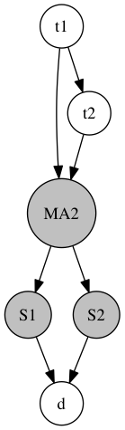

.. ELFI documentation master file. It should at least contain the root `toctree` directive.

ELFI - Engine for Likelihood-Free Inference
===========================================

ELFI is a Python software package for likelihood-free inference (LFI) such as
Approximate Bayesian Computation (ABC_). ELFI features a convenient graph
based presentation for your generative model and supports parallelized inference out of
the box.

.. _ABC: https://en.wikipedia.org/wiki/Approximate_Bayesian_computation

See :doc:`the quickstart <quickstart>` to get started.

ELFI is licensed under BSD3_. The source is in GitHub_.

.. _BSD3: https://opensource.org/licenses/BSD-3-Clause
.. _GitHub: https://github.com/elfi-dev/elfi

Currently implemented LFI methods:
----------------------------------

- ABC rejection sampler
- Sequential Monte Carlo ABC sampler
- Bayesian Optimization for Likelihood-Free Inference (BOLFI_) framework

.. _BOLFI: http://jmlr.org/papers/v17/15-017.html

ELFI also has the following non LFI methods:

- Bayesian Optimization
- No-U-Turn-Sampler_, a Hamiltonian Monte Carlo MCMC sampler

.. _No-U-Turn-Sampler: http://jmlr.org/papers/volume15/hoffman14a/hoffman14a.pdf

.. toctree::
    :maxdepth: 1
    :caption: Getting started

    quickstart
    installation
    api
    faq

.. toctree::
    :maxdepth: 1
    :caption: Usage

    usage/models
    usage/inference
    usage/parallel
    usage/implementing-methods

.. toctree::
    :maxdepth: 1
    :caption: Developer documentation

    developer/architecture
    developer/extensions
    developer/contributing